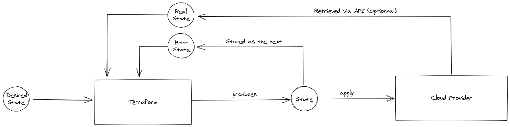
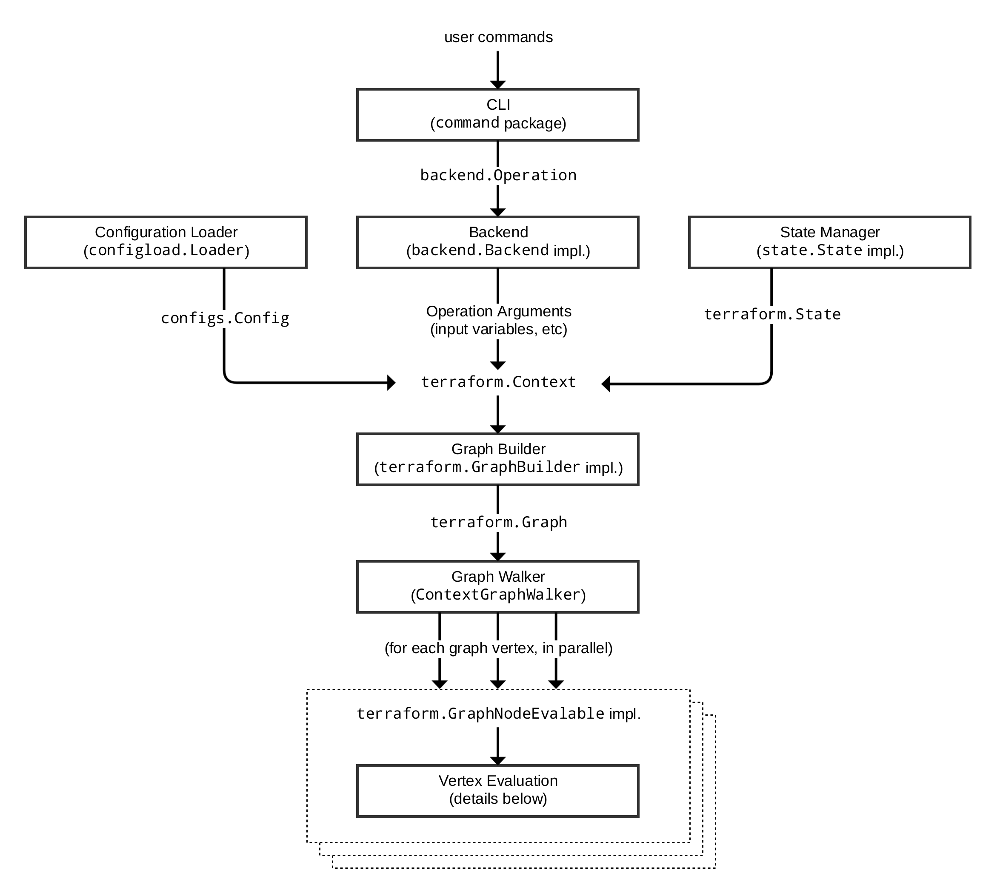
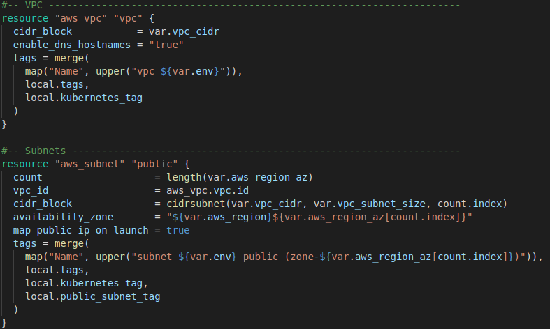
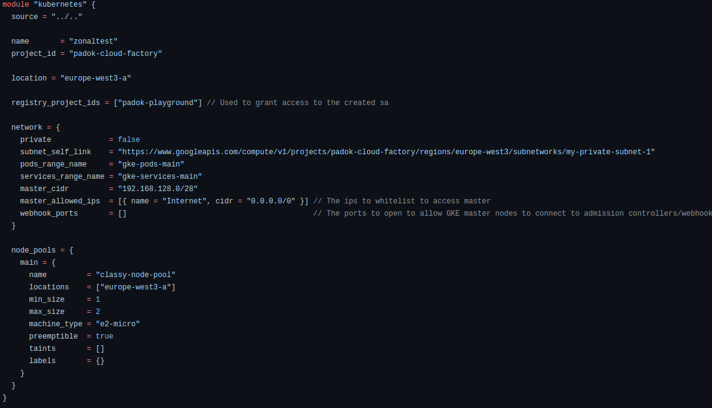
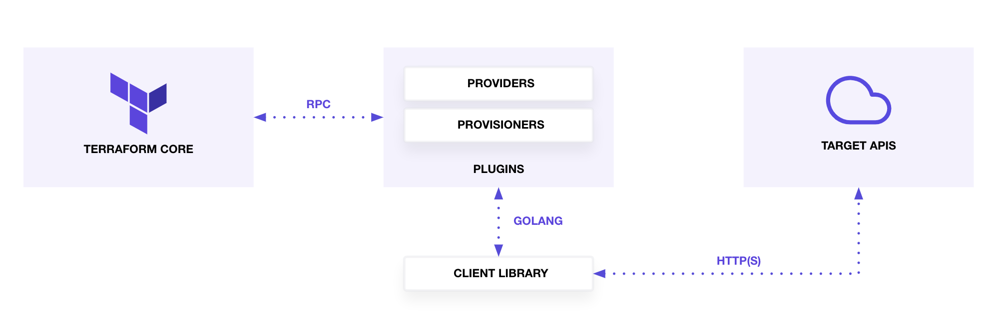
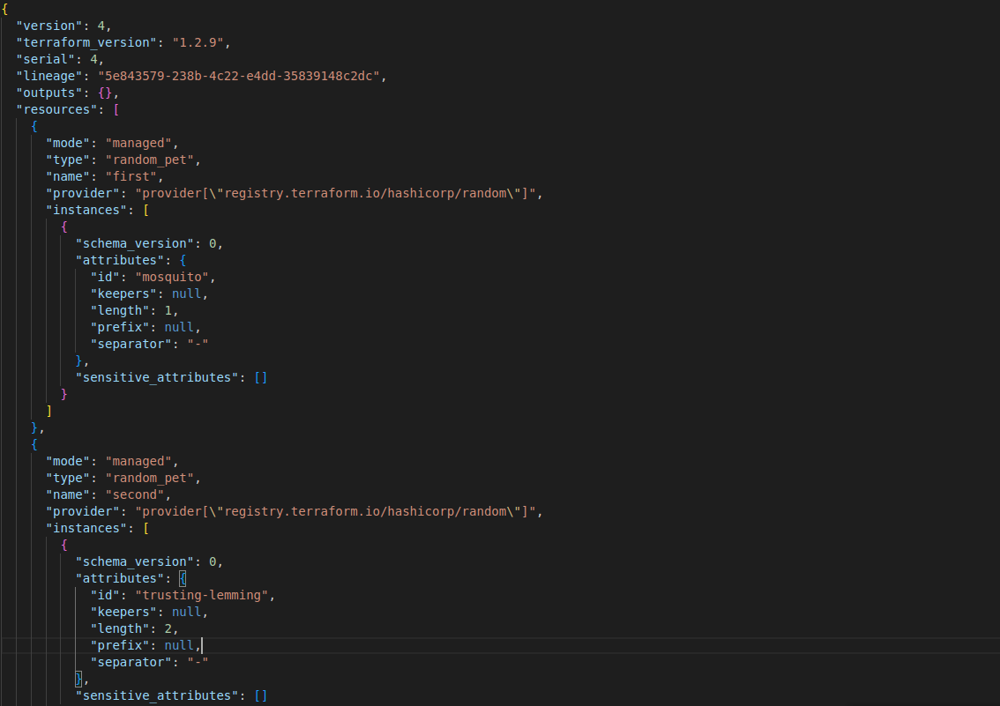
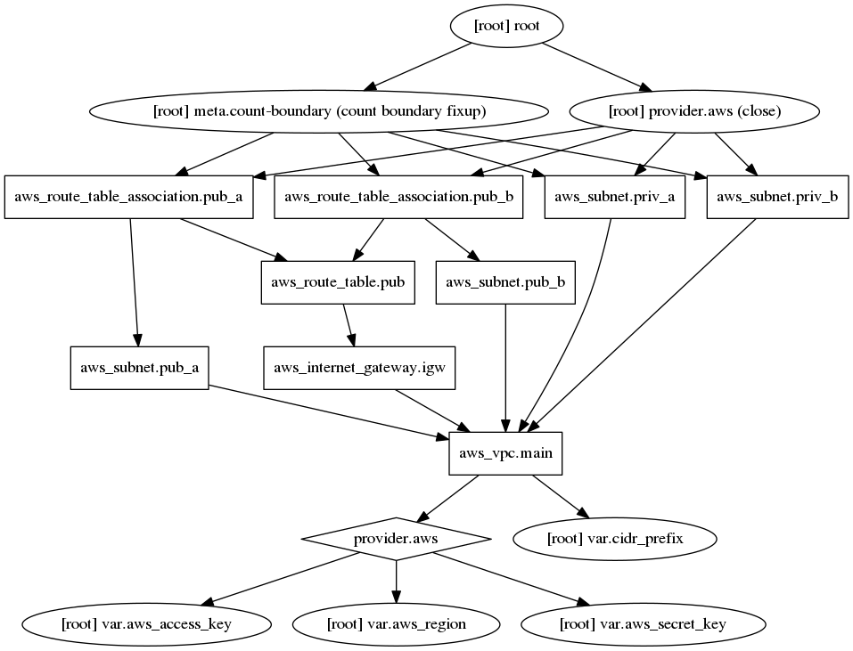
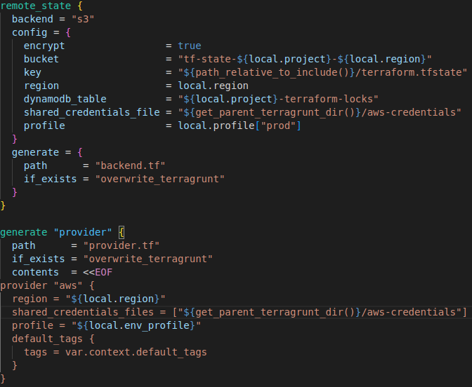
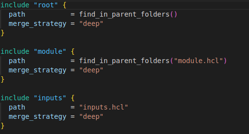

---

# Terragrunt


---

# Overview

---



---



---

<div class="columns">
<div>

## Vocabulary

</div>

<div>

- Resource
- Module
- Provider
- State
- Workspace
- HCL (Hashicorp Configuration Language)

</div>

---

# Resource

---



---

# Module

---



---

- Has Variables
- Has Outputs
- Should create multiple resources
- Wrapper around one resource is not recommended
- Meta-modules are ok but should not be too deep

---

# Provider

---



---

- Call the cloud provider API
- Perform CRUD (Create, Read, Update, Delete) Actions
- Are maintained by Hashicorp, the API provider and the community

---

# State

---



---

- Contains the last attributes seen by Terraform
- Is updated only on `apply`
- Is usually stored in a bucket for collaboration

---

# Workspace

---

- A Workspace is a dedicated state
- By default Terraform uses the `default` workspace
- You can change it by using
- `terraform workspace select <workspace>`

---

- Workspaces are not used a lot
- They should not be used as a mean to represent an environment

---

# Graph building

---


---



---

# Layer or Stack

---

- Introduced by the community
- Means to split a complex infrastructure
- A Layer should represent a part of your infrastructure a team is in charge of (e.g. Network)
- Each layer has a dedicated state
- In a sense are a lot like workspaces
- But do not share exactly the same code

---

# Module Best practices

---

- Modules should be opinionated and designed to do one thing well.
- Evaluating a module should be based of
  - Encapsulation: Group infrastructure that is always deployed together.
  - Privileges: Restrict modules to privilege boundaries.
  - Volatility: Separate long-lived infrastructure from short-lived.
- Nesting modules is ok, as long as you don't nest them too much (2-deep limit).

---

- You can nest modules that does tagging/labelling/naming as much as you want.
- Inputs and Outputs should follow a consistent naming convention.
- Using a module in a layer should always specify the version.

---

- Breaking changes between versions of modules must be documented.
- Pay peculiar attention to required and optional variables
- Only one module per repository
- Modules should be tagged using semantic versionning.
- Modules should follow a strict repository setup that defines which tf files must be present.

---

## Let's take a break

have a stretch
drink some water

---

# Terragrunt


---

- Terragrunt is a complete wrapper around Terraform
- It adds new features and is based entirely around the concept of layer/stack
- Provides way to diminish the number of code duplication

---

```
terraform plan
terraform apply
```

```
terragrunt plan
terragrunt apply
```

---

- In Terragrunt each Layer is an instance of a module
- It forces you to create modules with a meaning
- Introduces multiple level of variables from less precise to most precise (e.g. common accross environments, specific to an environment)

---

- Uses a superset of HCL to achieve this
- It introduces new functions that can help keep your code DRY (Don't repeat yourself)

---

# Let's take a look

---

# `terragrunt.hcl` file

---

- There will always be a root `terragrunt.hcl` file
- There will always be a per-layer `terragrunt.hcl` file

---

- The root `terragrunt.hcl` file defines variables and terraform code that will be used by all layers
- The child `terragrunt.hcl` file will define the inclusion order of your variable files

---



---



---

- You can also define other files that will be included when executing `terragrunt`
- The order in which you define the different include will define the override order (First being less precise, last being most precise)

---

- In terraform to retrieve the outputs of another layer
- You need to use the `terraform_remote_state` datasource
- In terragrunt you can introduce `dependency` to retrieve those outputs

---

```hcl
dependency "accepter" {
  config_path = ../layers/accepter/staging"
}

dependency "requester" {
  config_path = ../layers/requester/staging
}

inputs = {
  accepter_vpc_id  = dependency.accepter.outputs.vpc_id
  requester_vpc_id = dependency.requester.outputs.vpc_id
}
```

---

# How does it work ?

---

# Let's do some exercices now
